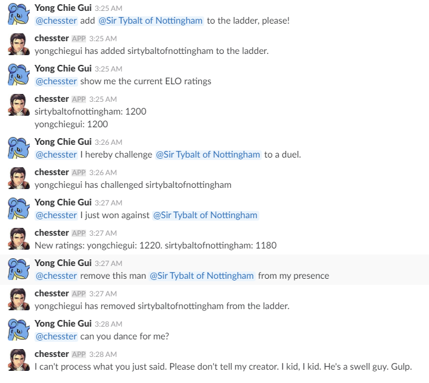

# Chesster, the modest Destoyer of Kings and Promoter of Pawns

Chesster is a Slack bot user that allows you to keep track of the chess ELO ratings of everyone in
your team. Upon receiving commands, Chesster will fetch the ratings from an AWS S3 bucket, edit,
and store them back in the same bucket.




### Motivation
My coworkers and I often played chess during office downtime, and we kept track of ratings
by sticking names on a bulletin board. I wrote this for convenience purposes to improve on
the static bulletin board ladder.

### Installation
Several steps required due to the Slack application settings and AWS configurations specific
to your team.

- Install the required python packages
    ```
    pip install -r requirements.txt
    ```
- Rename `config.json.example` to `config.json` and change the following variables to suit your 
team's AWS and Slack application bot user settings:

    ```
    AWS['ACCESS_KEY_ID']: your AWS account's access key ID
    AWS['SECRET_ACCESS_KEY']: your AWS account's secret access key
    AWS['S3']['BUCKET_NAME']: your AWS S3 bucket name
    AWS['S3']['FILE_NAME']: name of CSV file in S3 bucket that contains the ratings (e.g. chess_ratings.csv)
    CHESSTER['ID']: your Slack bot user's id
    CHESSTER['TOKEN']: your Slack bot user OAuth Access Token
    ```

### Usage
- Run Chesster
    ```
    python chesster.py
    ```
- Issue Chesster a command from your Slack chat
    ```
    @chesster add @SlackUser
    @chesster remove @SlackUser
    @chesster show
    @chesster challenge @SlackUser
    @chesster win @SlackUser
    @chesster lose @SlackUser
    @chesster draw @SlackUser
    ```